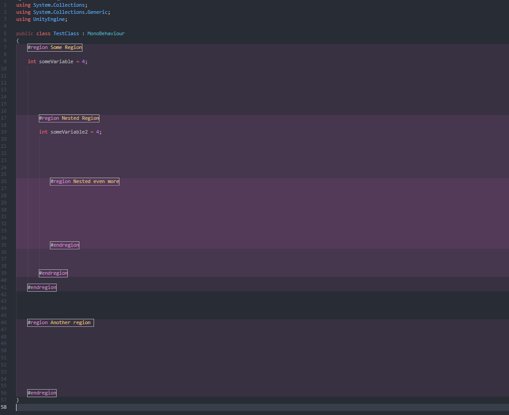

# Regions with Colors

Colorized C# regions and also supports indented regions

## Extension Settings

This extension contributes the following settings:

* `regionsWithColors.color`: color used to colorize region space
* `regionsWithColors.box`: whether or not to show an outline around the #region and #endregion tags

